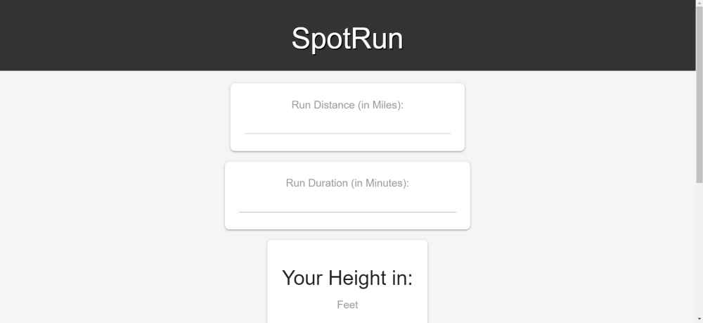

# SpotRun

# URL
https://xue-f-yang.github.io/SpotRun/
git@github.com:Xue-F-Yang/SpotRun.git

# Introduction:
SpotRun is a music selection form that allows users to select their preferred music genre(s) and other running preferences such as distance, duration, and height. The form is designed to help users create a personalized music playlist that matches their running preferences. This README file provides an overview of the SpotRun music selection form and how to use it.

# Features:
Users can select their preferred music genre(s) from a dropdown list that includes pop, rock, hip hop, and country.

Users can input their running preferences such as distance, duration, and height.

The form includes a countdown timer that displays the remaining time for the user's selected duration.

The form includes a loading circle that appears when the user clicks the submit button.

The form is designed to be mobile-friendly and optimized for different screen sizes.

# How to Use:
1. Open the SpotRun music selection form in a web browser.

2. Select your preferred music genre(s) from the dropdown list.

3. Input your running preferences such as distance, duration, and height.

4. Click the submit button to generate your personalized music playlist.

5. Wait for the loading circle to appear while the form generates your playlist.

6. Once the loading circle disappears, your personalized music playlist will be displayed.

# Acknowledgments
SpotRun was inspired by the need for a simple and effective music player for runners. We would like to thank the developers of the Google API and the YouTube API for making this project possible.

# Conclusion:
The SpotRun music selection form is a user-friendly and customizable tool that allows users to create a personalized music playlist that matches their running preferences. The form is optimized for different screen sizes and includes features such as a countdown timer and loading circle to enhance the user experience.

# Screenshot
